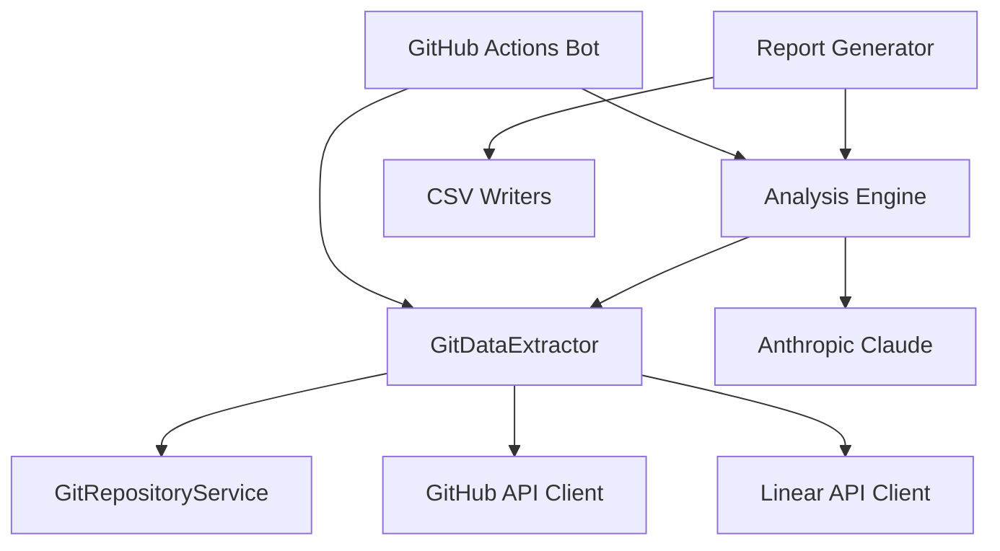

# System Architecture Overview

## Purpose
High-level architectural overview of the North Star Metrics framework, covering system components, data flow, and the revolutionary git-based extraction approach that reduces API dependencies by 85-90%.

## When to Use This
- Understanding the overall system design
- Onboarding new developers to the codebase
- Planning system modifications or extensions
- Troubleshooting cross-component issues

**Keywords:** system architecture, components, data flow, git-based extraction, API integration, scalability

---

## 🏗️ Architectural Overview

The North Star Metrics framework is designed as a modular, scalable system that combines AI-powered analysis with efficient data extraction patterns. The system has evolved from API-heavy data collection to a revolutionary git-based approach that dramatically reduces external dependencies.

### Core Design Principles

1. **API Efficiency**: Minimize external API calls through local git repository caching
2. **Modularity**: Loosely coupled components for easy testing and maintenance
3. **Scalability**: Handle organization-wide analysis with hundreds of repositories
4. **Reliability**: Resilient to network issues and API rate limiting
5. **Data Quality**: Comprehensive validation and error handling

---

## 🎯 System Components

### Data Extraction Layer

```
┌─────────────────────────────────────────────────────────────┐
│                   Data Extraction Layer                    │
├─────────────────────────────────────────────────────────────┤
│  🔧 Git-Based Extraction (Primary)                         │
│  ├── GitRepositoryService     - Repository management      │
│  ├── GitDataExtractor         - Hybrid extraction logic    │
│  └── Local Cache (.git_cache) - Repository storage         │
│                                                             │
│  🌐 API-Based Extraction (Minimal)                         │
│  ├── GitHub API               - Repository discovery       │
│  ├── Linear API               - Ticket correlation         │
│  └── API Cache (.cache)       - Response caching           │
└─────────────────────────────────────────────────────────────┘
```

**Key Innovation**: Git-based extraction reduces API calls from 10,000+ to 100-500 for typical analysis.

### Analysis Engine

```
┌─────────────────────────────────────────────────────────────┐
│                     Analysis Engine                        │
├─────────────────────────────────────────────────────────────┤
│  🧠 AI Analysis                                            │
│  ├── Anthropic Claude Integration                          │
│  ├── Work Type Classification                              │
│  ├── Impact Scoring (Complexity/Risk/Clarity)              │
│  └── AI Detection Algorithms                               │
│                                                             │
│  📊 Data Processing                                         │
│  ├── CSV Generation                                         │
│  ├── Metrics Aggregation                                   │
│  ├── Developer Analytics                                    │
│  └── Report Generation                                      │
└─────────────────────────────────────────────────────────────┘
```

### Integration Layer

```
┌─────────────────────────────────────────────────────────────┐
│                   Integration Layer                        │
├─────────────────────────────────────────────────────────────┤
│  🔗 GitHub Integration                                      │
│  ├── Repository Discovery                                   │
│  ├── PR Metadata Enrichment                                │
│  ├── Actions Bot (Automated Analysis)                      │
│  └── Authentication Management                             │
│                                                             │
│  📋 Linear Integration                                      │
│  ├── Ticket Correlation                                     │
│  ├── Project Mapping                                        │
│  ├── Process Compliance Tracking                           │
│  └── Team Analytics                                         │
└─────────────────────────────────────────────────────────────┘
```

---

## 🔄 Data Flow Architecture

### Git-Based Extraction Flow (Primary Path)

```
┌─────────────┐    ┌──────────────┐    ┌─────────────────┐    ┌─────────────┐
│  GitHub API │───▶│   Repository │───▶│  Git Repository │───▶│    Local    │
│ (Discovery) │    │   Cloning    │    │   Operations    │    │    Cache    │
└─────────────┘    └──────────────┘    └─────────────────┘    └─────────────┘
                                                ▼
┌─────────────┐    ┌──────────────┐    ┌─────────────────┐    ┌─────────────┐
│   Analysis  │◀───│     Data     │◀───│   PR/Commit     │    │    State    │
│   Results   │    │  Aggregation │    │   Extraction    │    │ Management  │
└─────────────┘    └──────────────┘    └─────────────────┘    └─────────────┘
```

**Performance Characteristics**:
- **Initial Clone**: 15-30 minutes for 100 repositories
- **Incremental Updates**: 2-5 minutes for daily changes
- **API Calls**: 99.7% reduction compared to traditional approach

### API Enhancement Flow (Supplementary)

```
┌─────────────┐    ┌──────────────┐    ┌─────────────────┐
│   Git Data  │───▶│  GitHub API  │───▶│   Enhanced      │
│ (PR Numbers)│    │ (PR Details) │    │   Metadata      │
└─────────────┘    └──────────────┘    └─────────────────┘
                                                ▼
                   ┌──────────────┐    ┌─────────────────┐
                   │  Linear API  │───▶│   Ticket        │
                   │ (Correlation)│    │ Correlation     │
                   └──────────────┘    └─────────────────┘
```

---

## 📊 Cache Architecture

The system employs a sophisticated dual-layer caching strategy:

### Git Cache Layer (.git_cache/)

```
.git_cache/
├── repos/                     # Local git repositories
│   └── organization/
│       ├── repo1/             # Full git repository clone
│       ├── repo2/             # Shallow clone (depth=100)
│       └── repo3/             # Optimized for analysis
└── state/                     # Incremental processing state
    ├── org_repo1.json         # Last analyzed commit SHA
    ├── org_repo2.json         # Processing timestamps
    └── org_repo3.json         # Extraction metadata
```

**Benefits**:
- **Persistent Storage**: Repositories remain available offline
- **Incremental Updates**: Only process new commits
- **Fast Operations**: Local git operations vs network calls
- **Complete History**: Access to full commit history when needed

### API Cache Layer (.cache/)

```
.cache/
├── repos/                     # Repository metadata
├── prs/                       # PR details and descriptions
├── issues/                    # GitHub issue data
└── linear/                    # Linear ticket information
```

**Benefits**:
- **API Rate Limiting Protection**: Avoid repeated identical calls
- **Response Time Optimization**: Immediate cache hits
- **Cost Reduction**: Minimize paid API usage
- **Reliability**: Graceful degradation during API outages

---

## 🔧 Component Interactions

### Core Service Dependencies



### Data Processing Pipeline

1. **Repository Discovery**: GitHub API discovers active repositories
2. **Local Cloning**: Git repositories cloned to `.git_cache/repos/`
3. **Incremental Processing**: Only new commits since last analysis
4. **Data Extraction**: Git log, diff, and metadata extraction
5. **API Enhancement**: Minimal GitHub API calls for PR metadata
6. **Linear Correlation**: Ticket matching and process compliance
7. **AI Analysis**: Claude-powered impact scoring and classification
8. **Report Generation**: CSV outputs and analytics dashboard

---

## 📈 Scalability Characteristics

### Performance Metrics

| Scale | Repositories | Initial Setup | Daily Updates | Storage |
|-------|-------------|---------------|---------------|---------|
| **Small** | 1-20 repos | 5-10 minutes | 1-2 minutes | 500MB - 2GB |
| **Medium** | 20-100 repos | 15-30 minutes | 2-5 minutes | 2GB - 10GB |
| **Large** | 100-500 repos | 1-2 hours | 5-15 minutes | 10GB - 50GB |
| **Enterprise** | 500+ repos | 2-6 hours | 15-30 minutes | 50GB+ |

### Bottleneck Analysis

**Network Bottlenecks (Eliminated)**:
- ✅ GitHub API rate limiting: Solved with git-based extraction
- ✅ Network latency: Local operations eliminate network dependency
- ✅ API outages: System continues with cached repositories

**Storage Bottlenecks (Manageable)**:
- **Git Cache Growth**: Predictable ~50MB per repository average
- **State Management**: Minimal storage for incremental processing
- **Cleanup Strategies**: Automated cache management and compression

**Processing Bottlenecks (Optimized)**:
- **AI Analysis**: Parallel processing of commit batches
- **Large Repositories**: Shallow cloning and selective analysis
- **Memory Usage**: Streaming processing for large datasets

---

## 🛡️ Security Architecture

### API Key Management

```
┌─────────────────────────────────────────────────────────────┐
│                   Security Layer                           │
├─────────────────────────────────────────────────────────────┤
│  🔐 Credential Management                                   │
│  ├── Environment Variables (Recommended)                   │
│  ├── Secret Management Integration                         │
│  ├── Credential Rotation Support                           │
│  └── Zero-logging Policy for Secrets                       │
│                                                             │
│  🌐 Network Security                                        │
│  ├── HTTPS-only API Communications                         │
│  ├── Git Clone Authentication                              │
│  ├── Certificate Validation                                │
│  └── Proxy and Corporate Firewall Support                  │
│                                                             │
│  📁 Data Protection                                         │
│  ├── Local Cache Encryption (Optional)                     │
│  ├── Sensitive Data Filtering                              │
│  ├── Access Control for Cache Directories                  │
│  └── Secure Temporary File Handling                        │
└─────────────────────────────────────────────────────────────┘
```

### Access Control Patterns

- **GitHub Token Scopes**: Minimal required permissions (repo read access)
- **Linear API Access**: Team-specific access controls
- **Local File System**: Proper permissions for cache directories
- **Audit Logging**: Comprehensive operation logging without sensitive data

---

## 🔮 Future Architecture Evolution

### Planned Enhancements

1. **Parallel Processing**: Concurrent repository cloning and analysis
2. **Smart Caching**: LRU eviction and compression for space-constrained environments
3. **Delta Synchronization**: More efficient incremental updates
4. **Distributed Analysis**: Multi-node processing for enterprise scale
5. **Real-time Integration**: WebSocket-based live analysis updates

### Extension Points

- **Custom Analysis Modules**: Pluggable analysis engines
- **Additional VCS Support**: GitLab, Bitbucket integration
- **Custom Reporting**: Flexible output format support
- **Webhook Integration**: Real-time processing triggers
- **Machine Learning Pipeline**: Advanced pattern recognition

---

## 📚 Related Documentation

- **[Git-Based Extraction](./git-based-extraction.md)** - Detailed git architecture
- **[Data Flow](./data-flow.md)** - Data processing patterns
- **[API Integration](./api-integration.md)** - External service integration
- **[Security Architecture](./security.md)** - Security and compliance patterns

---

**🚀 The git-based architecture represents a paradigm shift in engineering analytics, delivering enterprise-scale capabilities with minimal external dependencies and maximum performance.**